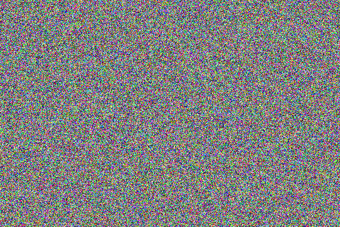

# Dot Usage

**Class:** Dot  
**Inherits:** Shape

## Overview

A `Dot` is a single pixel on the screen, implemented as a 1x1 [Rectangle](RectangleUsage.md). Use this class to draw individual pixels with specific colors and positions.

## Constructor

```cpp
Dot d;  // Creates a dot at (0, 0) with black color
```

## Inherited Methods

Dot inherits all methods from [Shape](shape.md), [Point](PointUsage.md), and [Color](ColorUsage.md):

```cpp
// Position methods
void setPoint(int16_t x, int16_t y);
int16_t getX();
int16_t getY();

// Color methods
void setColor(uint16_t c);
void setRGB(uint32_t rgb);
void setR(uint8_t r);
void setG(uint8_t g);
void setB(uint8_t b);

// Drawing
void draw(Screen* scr);
```

## Basic Example

```cpp
Screen* scr;
// Initialize your screen...

Dot d;
d.setPoint(100, 50);      // Position at (100, 50)
d.setRGB(0xFF0000);       // Red color
d.draw(scr);              // Draw to screen
```

## Complete Example: Random Pixels

```cpp
Screen* scr;

void setup() {
    // Initialize your screen...
    
    scr->clear();
    randomSeed(analogRead(0));

    Dot d;
    uint16_t w = scr->getWidth();
    uint16_t h = scr->getHeight();

    // Fill screen with random colored pixels
    for (int y = 0; y < h; y++) {
        for (int x = 0; x < w; x++) {
            d.setPoint(x, y);
            d.setColor(random(0xFFFF));
            d.draw(scr);
        }
    }
}
```

### Output


