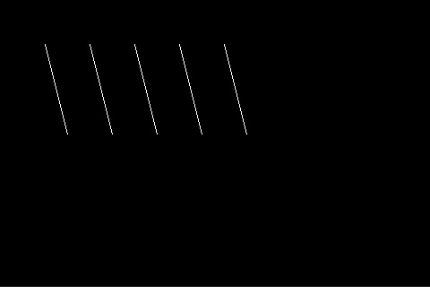

# Line Usage

**Class:** Line  
**Inherits:** Shape

## Overview

A `Line` is drawn as a series of connected dots using [Bresenham's line algorithm](https://en.wikipedia.org/wiki/Bresenham%27s_line_algorithm). Lines are defined by a start point, end point, and color.

## Constructor

```cpp
Line l;  // Creates a line from (0, 0) to (0, 0)
```

## Methods

In addition to inherited Point and Color methods:

### End Point Management

```cpp
void setEndPoint(Point p);
void setEndPoint(int16_t x, int16_t y);
Point getEndPoint();
```

### Movement Methods

```cpp
// Move both start and end points
void moveTo(Point p);
void moveTo(int16_t x, int16_t y);
void moveToX(int16_t x);
void moveToY(int16_t y);

// Set end point relative to start point
void lineTo(double direction, double distance);
```

## Basic Example

```cpp
Screen* scr;
// Initialize your screen...

Line l;
l.setColor(0xFFFF);       // White
l.setPoint(50, 50);       // Start point
l.setEndPoint(75, 150);   // End point
l.draw(scr);
```

## Complete Example: Parallel Lines

```cpp
Screen* scr;

void setup() {
    // Initialize your screen...
    
    scr->clear();

    Line l;
    l.setColor(0xFFFF);       // White color
    l.setPoint(50, 50);       // Start at (50, 50)
    l.setEndPoint(75, 150);   // End at (75, 150)

    // Draw 5 parallel lines
    for (int i = 0; i < 5; i++) {
        l.draw(scr);
        l.move(90, 50);       // Move right by 50 pixels
    }
}
```

### Output


