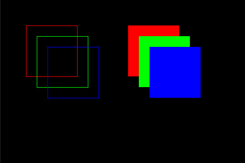

# Rectangle Usage

**Class:** Rectangle  
**Inherits:** Shape  
**Implements:** Fillable

## Overview

Rectangles are the foundation of all graphics operations in TFT Framework. All rendering ultimately relies on the `fillRect()` method. For example:
- A **Dot** is a 1×1 rectangle
- A horizontal or vertical **Line** is a 1×N or N×1 rectangle

Rectangles can be both drawn (outline) and filled (solid color).

## Constructor

```cpp
Rectangle r;  // Creates a rectangle at (0, 0) with size (0, 0)
```

## Methods

In addition to inherited Point and Color methods:

### Dimension Management

```cpp
void setSize(int16_t w, int16_t h);
void setSize(Rectangle r);
void setWidth(int16_t w);
void setHeight(int16_t h);

uint16_t getWidth();
uint16_t getHeight();
```

### Drawing

```cpp
void draw(Screen* scr);  // Draw outline
void fill(Screen* scr);  // Fill with solid color
```

**Note:** Negative width or height values place the end point to the upper-left of the start point.

## Basic Example

```cpp
Screen* scr;
// Initialize your screen...

Rectangle r;
r.setPoint(50, 50);       // Position
r.setSize(100, 80);       // Size
r.setRGB(0xFF0000);       // Red
r.draw(scr);              // Draw outline
r.fill(scr);              // Fill with color
```

## Complete Example: RGB Rectangles

```cpp
Screen* scr;

void setup() {
    // Initialize your screen...
    
    scr->clear();

    // Red, green, and blue
    uint32_t colors[] = {0xFF0000, 0x00FF00, 0x0000FF};

    Rectangle r;
    r.setPoint(50, 50);
    r.setSize(100, 100);

    // Draw outlines
    for (int i = 0; i < 3; i++) {
        r.setRGB(colors[i]);
        r.draw(scr);
        r.move(135, 30);  // Move diagonally
    }

    // Draw filled rectangles
    r.moveTo(250, 50);
    for (int i = 0; i < 3; i++) {
        r.setRGB(colors[i]);
        r.fill(scr);
        r.move(135, 30);
    }
}
```

### Output


