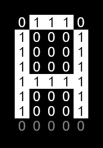
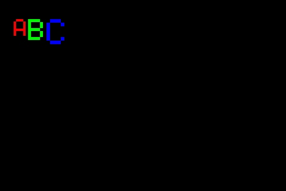

# Font Usage

**Class:** Font  
**Inherits:** Shape  
**Not Fillable**

## Overview

Font is a drawable shape that renders text characters. The default 5×7 matrix font is built into the framework and stored in program memory (ROM).

## Font Matrix Format

The 5×7 font uses a matrix array for each character. For example, the letter 'A':

```
Hex values: [0x7E], [0x11], [0x11], [0x11], [0x7E]

Binary representation:
01111110 (0x7E)
00010001 (0x11)
00010001 (0x11)
00010001 (0x11)
01111110 (0x7E)
```

While the font is called "5×7", it actually uses a 5×8 bit pattern for easier handling, with the last row unused.



**Supported Characters:** ASCII codes 0x20 (space) to 0x7E (~)

For implementation details, see [Font5X7.cpp](/tft_framework/src/Font5X7.cpp).

## Methods

### Character Management

```cpp
uint32_t getChar();
void setChar(uint32_t c);
```

### Scaling

```cpp
uint8_t getScale();
void setScale(uint8_t s);  // 1 = normal size, 2 = 2x, etc.
```

### Dimensions

```cpp
uint8_t getWidth();        // Base character width
uint8_t getHeight();       // Base character height

uint8_t getTotalWidth();   // Width including padding and spacing
uint8_t getTotalHeight();  // Height including padding
```

## Basic Example

```cpp
Screen* scr;
// Initialize your screen...

Font* f = scr->getFont();
f->setScale(2);           // 2x size
f->setPoint(10, 10);      // Position
f->setRGB(0xFF0000);      // Red
f->setChar('A');          // Character to draw
f->draw(scr);
```

## Complete Example: Scaled Characters

```cpp
Screen* scr;

void setup() {
    // Initialize your screen...
    
    scr->clear();

    Font* f = scr->getFont();
    
    // Character 'A' at 4x scale
    f->setScale(4);
    uint16_t w = f->getTotalWidth();
    uint16_t h = f->getTotalHeight();
    f->setPoint(w, h);
    f->setRGB(0xFF0000);  // Red
    f->setChar('A');
    f->draw(scr);
    f->move(90, w);       // Move right
    
    // Character 'B' at 5x scale
    f->setScale(5);
    w = f->getTotalWidth();
    f->setRGB(0x00FF00);  // Green
    f->setChar('B');
    f->draw(scr);
    f->move(90, w);
    
    // Character 'C' at 6x scale
    f->setScale(6);
    w = f->getTotalWidth();
    f->setRGB(0x0000FF);  // Blue
    f->setChar('C');
    f->draw(scr);
}
```

### Output



## Text Rendering

For easier text rendering with automatic positioning, use the Screen's `print()` methods instead of drawing individual Font objects. See [Screen Print](./print.md) documentation.
