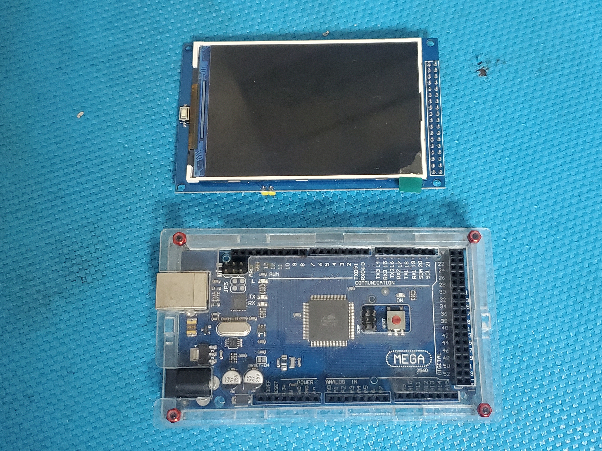
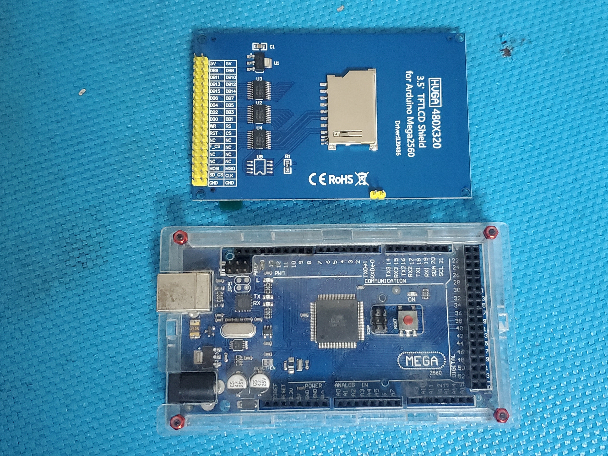
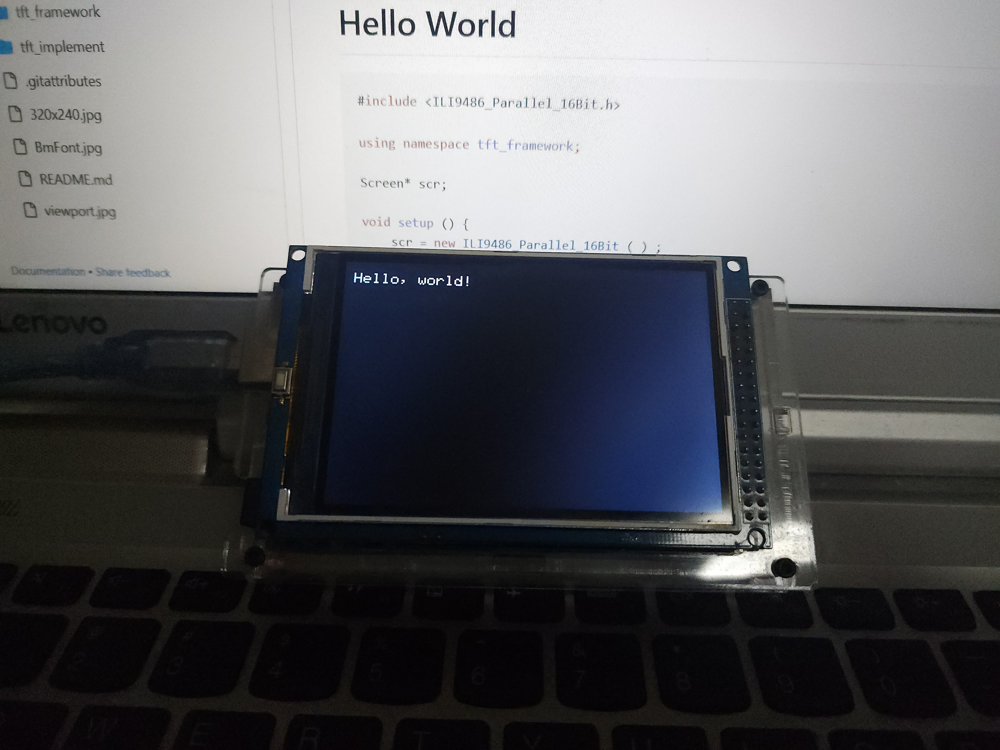

# Getting Started

TFT Framework is a graphics library for TFT displays on Arduino and embedded platforms. It provides a unified interface for drawing, filling, and text rendering across different TFT controllers.

## Demo

Watch the framework in action: [Demo Video](https://youtu.be/qud3bSVzDqk)

 

## Quick Start: Hello World

This example demonstrates the basic usage of TFT Framework with an ILI9486 display.

```cpp
#include <ILI9486_Parallel_16Bit.h>

using namespace tft_framework;

Screen* scr;

void setup() {
    // Initialize the screen
    scr = new ILI9486_Parallel_16Bit();
    scr->init();

    // Configure the font
    Font* fnt = scr->getFont();     // Default font is 5x7 matrix
    fnt->setScale(2);               // Scale font to 2x size

    // Calculate font dimensions
    uint8_t w = fnt->getTotalWidth();   // Font width: 12
    uint8_t h = fnt->getTotalHeight();  // Font height: 16
    
    // Set cursor position
    Point p(w, h);
    scr->setCursor(p);

    // Clear screen and print text
    scr->clear();
    scr->println("Hello, world!");
}

void loop() {
    delay(100000);
}
```

### Result



## Next Steps

- Learn about [Point](./PointUsage.md) and [Color](./ColorUsage.md) usage
- Explore [Shape drawing](./shape.md) capabilities
- Check [supported hardware](./hardware.md)