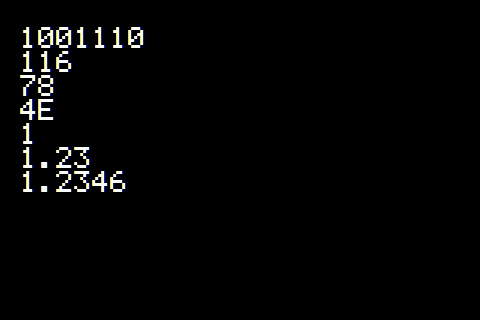
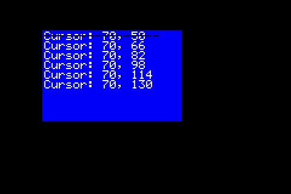
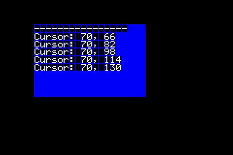
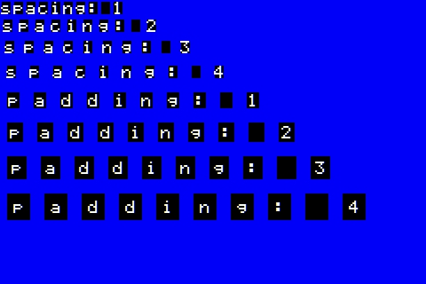

# Screen Print

The `Screen` class inherits from Arduino's `Print` class, providing familiar text output methods similar to `Serial`.

## Available Methods

```cpp
print()      // Print without newline
println()    // Print with newline
printf()     // Formatted print (C-style)
write()      // Write raw bytes
flush()      // Flush output buffer
```

## Basic Example

```cpp
Screen* scr;

void setup() {
    // Initialize your screen...
    
    scr->clear();

    Font* fnt = scr->getFont();
    fnt->setScale(3);

    uint16_t w = fnt->getTotalWidth();
    uint16_t h = fnt->getTotalHeight();

    scr->setCursor(w, h);

    // Print in different formats
    scr->println(78, BIN);      // "1001110"
    scr->println(78, OCT);      // "116"
    scr->println(78, DEC);      // "78"
    scr->println(78, HEX);      // "4E"
    scr->println(1.23456, 0);   // "1"
    scr->println(1.23456, 2);   // "1.23"
    scr->println(1.23456, 4);   // "1.2346"
}
```

### Output



---

## Cursor Management

The cursor defines where text will be printed on the screen.

### Methods

```cpp
void setCursor(Point cursor);
void setCursor(int16_t x, int16_t y);
Point getCursor();
void resetCursor();  // Reset to (0, 0)
```

### Example

```cpp
Screen* scr;

void setup() {
    // Initialize your screen...
    scr->clear();

    Font* fnt = scr->getFont();
    fnt->setScale(2);

    // Draw blue rectangle
    Rectangle r;
    r.setSize(300, 200);
    r.setPoint(70, 50);
    r.setRGB(0x0000FF);
    r.fill(scr);

    // Set cursor to rectangle position
    scr->setCursor(r);
    int16_t x = scr->getCursor().getX();
    int16_t y = scr->getCursor().getY();
    scr->printf("Cursor: %d, %d\n", x, y);

    // Print cursor position multiple times
    for (int i = 0; i < 5; i++) {
        x = scr->getCursor().getX();
        y = scr->getCursor().getY();
        scr->printf("Cursor: %d, %d\n", x, y);
    }

    // Change color and reset cursor
    fnt->setColor(0);
    scr->resetCursor();
    scr->print("----------------");
}
```

### Output



---

## Print Buffer

By default, text is drawn directly to the screen, which can cause overlapping when the cursor is reset. The print buffer solves this by rendering text to a buffer first, then filling it to the screen with a background color.

See [Buffer Screen](./buffered_screen.md) for more details.

### Methods

```cpp
void setPrintBuffer(boolean b);
boolean isPrintBuffer();
```

### Example

```cpp
Screen* scr;

void setup() {
    // Initialize your screen...
    scr->clear();

    // Enable print buffer
    scr->setPrintBuffer(true);

    Font* fnt = scr->getFont();
    fnt->setScale(2);

    Rectangle r;
    r.setSize(300, 200);
    r.setPoint(70, 50);
    r.setRGB(0x0000FF);
    r.fill(scr);

    scr->setCursor(r);
    int16_t x = scr->getCursor().getX();
    int16_t y = scr->getCursor().getY();
    scr->printf("Cursor: %d, %d\n", x, y);

    for (int i = 0; i < 5; i++) {
        x = scr->getCursor().getX();
        y = scr->getCursor().getY();
        scr->printf("Cursor: %d, %d\n", x, y);
    }

    scr->resetCursor();
    scr->print("----------------");  // No overlap!
}
```

### Output



---

## Spacing and Padding

Control the space around characters with spacing (outside) and padding (inside).

### Methods

```cpp
// Padding (inside the character area)
void setPaddingTop(uint8_t paddingTop);
void setPaddingLeft(uint8_t paddingLeft);
void setPaddingBottom(uint8_t paddingBottom);
void setPaddingRight(uint8_t paddingRight);

uint8_t getPaddingTop();
uint8_t getPaddingLeft();
uint8_t getPaddingBottom();
uint8_t getPaddingRight();

// Spacing (outside the character area)
void setSpacingTop(uint8_t spacingTop);
void setSpacingLeft(uint8_t spacingLeft);
void setSpacingBottom(uint8_t spacingBottom);
void setSpacingRight(uint8_t spacingRight);

uint8_t getSpacingTop();
uint8_t getSpacingLeft();
uint8_t getSpacingBottom();
uint8_t getSpacingRight();
```

### Example

```cpp
Screen* scr;

void setup() {
    // Initialize your screen...
    scr->clear();
    scr->setPrintBuffer(true);

    Font* fnt = scr->getFont();
    fnt->setScale(2);

    // Fill background
    Rectangle r;
    r.setSize(scr->getWidth(), scr->getHeight());
    r.setRGB(0x0000FF);
    r.fill(scr);

    // Demonstrate spacing
    for (int i = 1; i <= 4; i++) {
        fnt->setSpacingTop(i);
        fnt->setSpacingLeft(i);
        fnt->setSpacingBottom(i);
        fnt->setSpacingRight(i);
        scr->printf("spacing: %d\n", i);
    }

    // Demonstrate padding
    for (int i = 1; i <= 4; i++) {
        fnt->setPaddingTop(i);
        fnt->setPaddingLeft(i);
        fnt->setPaddingBottom(i);
        fnt->setPaddingRight(i);
        scr->printf("padding: %d\n", i);
    }
}
```

### Output


