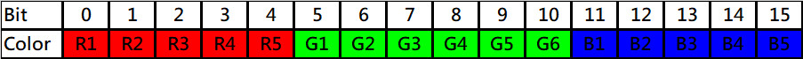

# Color Usage

The `Color` class handles color representation in RGB565 format (16-bit) for efficient display memory usage. It provides comprehensive color manipulation capabilities with conversion support between RGB565 and RGB888 formats.

> **Important Note:** The Color class is **not directly drawable**. It provides color information for other drawable objects like Shape, Dot, Line, Rectangle, etc.

## Overview

- **Format**: RGB565 (16-bit) - 5 bits Red, 6 bits Green, 5 bits Blue
- **Storage**: 2 bytes per color (65,536 possible colors)
- **Efficient**: Optimized for TFT displays with limited memory
- **Conversion**: Support for RGB888 (24-bit) with automatic conversion
- **Inheritance**: Base class for Shape and all drawable objects

## Color Format: RGB565



The RGB565 format uses 16 bits to represent colors:
```
Bit Layout: RRRRR GGGGGG BBBBB
            15-11  10-5    4-0

Red:   5 bits (0-31)   → 32 levels
Green: 6 bits (0-63)   → 64 levels  (human eye is more sensitive to green)
Blue:  5 bits (0-31)   → 32 levels

Total: 16 bits = 65,536 colors
```

## Constructors

```cpp
Color()                                // Create black (0x0000)
Color(uint16_t color)                  // Create from RGB565 value
Color(uint8_t r, uint8_t g, uint8_t b) // Create from RGB888 components
```

**Examples:**
```cpp
using namespace tft_framework;

Color c1;                     // Black (0x0000)
Color c2(0xFFFF);            // White
Color c3(0xF800);            // Red in RGB565
Color c4(255, 0, 0);         // Red in RGB888
Color c5(128, 128, 128);     // Gray
```

## Static Color Constants

The Color class provides predefined constants for common colors:

```cpp
Color::BLACK      // 0x0000 - RGB(0, 0, 0)
Color::WHITE      // 0xFFFF - RGB(255, 255, 255)
Color::RED        // 0xF800 - RGB(255, 0, 0)
Color::GREEN      // 0x07E0 - RGB(0, 255, 0)
Color::BLUE       // 0x001F - RGB(0, 0, 255)
Color::YELLOW     // 0xFFE0 - RGB(255, 255, 0)
Color::CYAN       // 0x07FF - RGB(0, 255, 255)
Color::MAGENTA    // 0xF81F - RGB(255, 0, 255)
```

**Example:**
```cpp
Color red = Color::RED;
Color blue = Color::BLUE;

// Use with drawable objects
Dot pixel(100, 100);
pixel.setColor(Color::RED);
pixel.draw(scr);
```

## RGB565 Methods

### Get RGB565 Value

```cpp
uint16_t getColor() const
```

Get the 16-bit RGB565 color value. This is a `const` method.

**Example:**
```cpp
Color c(0xF800);              // Red
uint16_t value = c.getColor(); // value = 0xF800

const Color white = Color::WHITE;
uint16_t w = white.getColor(); // Works with const objects
```

### Set RGB565 Value

```cpp
void setColor(uint16_t color)
void setColor(const Color& c)
```

Set color from RGB565 value or copy from another Color object.

**Example:**
```cpp
Color c;
c.setColor(0xF800);           // Set to red
c.setColor(0x07E0);           // Set to green

Color c2 = Color::BLUE;
c.setColor(c2);               // Copy from c2
```

## RGB888 Component Methods

### Get Individual Components (const methods)

```cpp
uint8_t getR() const          // Get red (0-255)
uint8_t getG() const          // Get green (0-255)
uint8_t getB() const          // Get blue (0-255)
```

Extract and convert individual color components from RGB565 to 8-bit values.

**Example:**
```cpp
Color c(0xF800);              // Red
uint8_t r = c.getR();         // r = 255
uint8_t g = c.getG();         // g = 0
uint8_t b = c.getB();         // b = 0

const Color cyan = Color::CYAN;
uint8_t cg = cyan.getG();     // Works with const
```

### Set Individual Components

```cpp
void setR(uint8_t r)          // Set red (0-255)
void setG(uint8_t g)          // Set green (0-255)
void setB(uint8_t b)          // Set blue (0-255)
```

Set individual color components. Values are converted from 8-bit to RGB565.

**Example:**
```cpp
Color c;
c.setR(255);                  // Set red to maximum
c.setG(128);                  // Set green to half
c.setB(0);                    // Set blue to zero
```

### Get/Set 24-bit RGB

```cpp
uint32_t getRGB() const       // Get as 0x00RRGGBB
void setRGB(uint32_t rgb)     // Set from 0x00RRGGBB
void setRGB(uint8_t r, uint8_t g, uint8_t b)  // Set from components
```

**Example:**
```cpp
// Get 24-bit RGB
Color c = Color::RED;
uint32_t rgb = c.getRGB();    // rgb = 0x00FF0000

// Set from 24-bit RGB
c.setRGB(0x00FF00);           // Green
c.setRGB(0x336699);           // Custom color

// Set from components (most efficient)
c.setRGB(255, 128, 64);       // Orange
```

**Performance Note:** `setRGB(r, g, b)` is more efficient than calling `setR()`, `setG()`, `setB()` separately, as it performs all conversions in a single operation.

## Comparison Operators

```cpp
bool operator==(const Color& other) const
bool operator!=(const Color& other) const
```

Compare colors for equality based on their RGB565 values.

**Example:**
```cpp
Color c1(255, 0, 0);
Color c2 = Color::RED;
Color c3 = Color::BLUE;

if (c1 == c2) {               // true - both are red
    // Colors match
}

if (c1 != c3) {               // true - different colors
    // Colors are different
}

// Useful for checking states
if (object.getColor() == Color::RED) {
    // Object is red
}
```

## Color Conversion and Precision

### RGB888 to RGB565 Conversion

When converting from 24-bit RGB to 16-bit RGB565, lower bits are truncated:

```
Example: RGB(51, 102, 153) → 0x336699

Red:   51  = 0b00110011 → 5-bit: 0b00110 = 6  → back to 8-bit: 0b00110000 = 48
Green: 102 = 0b01100110 → 6-bit: 0b011001 = 25 → back to 8-bit: 0b01100100 = 100
Blue:  153 = 0b10011001 → 5-bit: 0b10011 = 19  → back to 8-bit: 0b10011000 = 152

Result: RGB(48, 100, 152) ≈ RGB(51, 102, 153)
```

**Key Points:**
- Red loses 3 bits precision (8 values per step)
- Green loses 2 bits precision (4 values per step)
- Blue loses 3 bits precision (8 values per step)
- Color difference is minimal and usually imperceptible

### Correct Bit Expansion Algorithm

The library uses proper bit expansion to minimize error:

```cpp
// For 5-bit to 8-bit (Red and Blue)
uint8_t value5bit = 0b10011;           // 5-bit value
uint8_t value8bit = (value5bit << 3) | (value5bit >> 2);
// Result: 0b10011100 - fills lower bits with MSBs

// For 6-bit to 8-bit (Green)
uint8_t value6bit = 0b011001;          // 6-bit value
uint8_t value8bit = (value6bit << 2) | (value6bit >> 4);
// Result: 0b01100101 - fills lower bits with MSBs
```

## Usage Examples

### Basic Color Creation and Usage

```cpp
using namespace tft_framework;

// Create colors
Color red(255, 0, 0);
Color green = Color::GREEN;
Color custom(0x336699);

// Use with drawable objects
Dot pixel;
pixel.setPoint(100, 100);
pixel.setColor(red);
pixel.draw(scr);

Line line;
line.setColor(Color::BLUE);
line.draw(scr);
```

### Color Manipulation

```cpp
Color c = Color::BLACK;

// Build color component by component
c.setR(255);                  // Add red
c.setG(128);                  // Add some green
c.setB(0);                    // No blue
// Result: Orange-ish color

// Or set all at once (faster)
c.setRGB(255, 128, 0);        // Same result, one operation
```

### Working with RGB565 Values

```cpp
// Direct RGB565 manipulation
Color c(0xF800);              // Red in RGB565
uint16_t value = c.getColor();

// Modify and set back
value = 0x07E0;               // Green in RGB565
c.setColor(value);

// Useful for storing colors in EEPROM or sending over serial
uint16_t savedColor = c.getColor();
// ... later ...
Color restored(savedColor);
```

### Color Comparison and State Management

```cpp
enum class State { IDLE, ACTIVE, ERROR };

Color getStateColor(State state) {
    switch (state) {
        case State::IDLE:   return Color::GREEN;
        case State::ACTIVE: return Color::YELLOW;
        case State::ERROR:  return Color::RED;
    }
}

// Usage
State currentState = State::ACTIVE;
Color indicatorColor = getStateColor(currentState);

if (indicatorColor == Color::RED) {
    // Handle error state
}
```

### Creating Custom Color Palettes

```cpp
// Define a custom palette
const Color PALETTE[] = {
    Color(0x001F),            // Dark blue
    Color(0x001F + 0x0400),   // Medium blue
    Color(0x001F + 0x0800),   // Light blue
    Color::CYAN,              // Cyan
    Color::WHITE              // White
};

// Use palette
for (int i = 0; i < 5; i++) {
    Dot d(i * 10, 100);
    d.setColor(PALETTE[i]);
    d.draw(scr);
}
```

### Gradient Generation

```cpp
// Simple gradient from red to blue
void drawGradient(Screen* scr, int x, int y, int width) {
    for (int i = 0; i < width; i++) {
        uint8_t r = 255 - (i * 255 / width);
        uint8_t b = (i * 255 / width);
        
        Color c;
        c.setRGB(r, 0, b);
        
        Line l(x + i, y, x + i, y + 10);
        l.setColor(c);
        l.draw(scr);
    }
}
```

### Color Analysis

```cpp
// Check if color is bright
bool isBright(const Color& c) {
    uint8_t r = c.getR();
    uint8_t g = c.getG();
    uint8_t b = c.getB();
    
    // Simple brightness calculation
    uint16_t brightness = (r + g + b) / 3;
    return brightness > 128;
}

// Check if color is grayscale
bool isGrayscale(const Color& c) {
    uint8_t r = c.getR();
    uint8_t g = c.getG();
    uint8_t b = c.getB();
    
    // Allow small differences due to RGB565 precision
    return (abs(r - g) < 10 && abs(g - b) < 10 && abs(r - b) < 10);
}

// Usage
Color color = Color::RED;
if (isBright(color)) {
    // Use dark text
} else {
    // Use light text
}
```

## Using Color with Drawable Objects

Color cannot be drawn directly - it must be used with drawable objects:

```cpp
// ❌ WRONG - Color has no draw() method
Color red = Color::RED;
// red.draw(scr);  // ERROR!

// ✅ CORRECT - Use with drawable objects
Dot pixel(50, 50);
pixel.setColor(Color::RED);
pixel.draw(scr);

Rectangle rect(100, 100, 200, 150);
rect.setColor(Color::BLUE);
rect.setFill(true);
rect.draw(scr);

Circle circle(160, 120, 50);
circle.setColor(Color::GREEN);
circle.draw(scr);
```

All drawable objects inherit from both Color and Shape (or Point), so they can:
- Store position information (from Point/Shape)
- Store color information (from Color)
- Draw themselves (draw() method)

## Performance Tips

### Efficient Color Operations

```cpp
// ❌ Slower - three separate operations
Color c;
c.setR(255);
c.setG(128);
c.setB(64);

// ✅ Faster - single operation
c.setRGB(255, 128, 64);

// ✅ Fastest - use RGB565 directly if you know the value
c.setColor(0xF810);
```

### Memory Efficiency

```cpp
// Using Color constants saves memory
void setIndicator(bool active) {
    indicator.setColor(active ? Color::GREEN : Color::RED);
    // Better than creating new Color objects each time
}

// Store colors as RGB565 for minimum memory
uint16_t palette[10];
palette[0] = Color::RED.getColor();
palette[1] = Color::GREEN.getColor();
// ... etc
```

### Const Correctness

```cpp
// Const Color objects can be used efficiently
const Color THEME_PRIMARY = Color(0x2196F3);
const Color THEME_ACCENT = Color(0xFF4081);

void drawHeader(Screen* scr) {
    Rectangle header(0, 0, 320, 40);
    header.setColor(THEME_PRIMARY);  // No copy, efficient
    header.draw(scr);
}
```

## Common Color Values (RGB565)

| Color      | RGB565  | RGB888      |
|------------|---------|-------------|
| Black      | 0x0000  | 0, 0, 0     |
| White      | 0xFFFF  | 255,255,255 |
| Red        | 0xF800  | 255, 0, 0   |
| Green      | 0x07E0  | 0, 255, 0   |
| Blue       | 0x001F  | 0, 0, 255   |
| Yellow     | 0xFFE0  | 255,255, 0  |
| Cyan       | 0x07FF  | 0,255,255   |
| Magenta    | 0xF81F  | 255, 0,255  |
| Orange     | 0xFD20  | 255,165, 0  |
| Purple     | 0x780F  | 128, 0,128  |
| Gray       | 0x8410  | 128,128,128 |
| Light Gray | 0xC618  | 192,192,192 |
| Dark Gray  | 0x4208  | 64, 64, 64  |

## Technical Notes

### RGB565 Bit Layout
```
15 14 13 12 11 | 10 9 8 7 6 5 | 4 3 2 1 0
R  R  R  R  R  | G  G G G G G | B B B B B
```

### Conversion Formulas

**RGB888 to RGB565:**
```cpp
uint16_t rgb565 = ((r & 0xF8) << 8) | ((g & 0xFC) << 3) | (b >> 3);
// Or more clearly:
uint16_t rgb565 = ((r >> 3) << 11) | ((g >> 2) << 5) | (b >> 3);
```

**RGB565 to RGB888:**
```cpp
uint8_t r = ((rgb565 >> 11) & 0x1F) << 3;
uint8_t g = ((rgb565 >> 5) & 0x3F) << 2;
uint8_t b = (rgb565 & 0x1F) << 3;

// With bit replication for better accuracy:
uint8_t r5 = (rgb565 >> 11) & 0x1F;
uint8_t r8 = (r5 << 3) | (r5 >> 2);  // Better
```

## Method Reference Summary

### Construction
- `Color()` - Black
- `Color(uint16_t)` - From RGB565
- `Color(r, g, b)` - From RGB888

### RGB565 Access
- `getColor()` const - Get RGB565 value
- `setColor(uint16_t)` - Set RGB565 value
- `setColor(const Color&)` - Copy color

### RGB888 Components
- `getR()` const - Get red (0-255)
- `getG()` const - Get green (0-255)
- `getB()` const - Get blue (0-255)
- `setR(uint8_t)` - Set red
- `setG(uint8_t)` - Set green
- `setB(uint8_t)` - Set blue

### RGB888 Complete
- `getRGB()` const - Get 0x00RRGGBB
- `setRGB(uint32_t)` - Set from 0x00RRGGBB
- `setRGB(r, g, b)` - Set from components (efficient)

### Operators
- `==` - Compare equality
- `!=` - Compare inequality

### Static Constants
- `BLACK`, `WHITE`, `RED`, `GREEN`, `BLUE`
- `YELLOW`, `CYAN`, `MAGENTA`

## See Also

- [Shape Class](shape.md) - Base class for drawable objects (inherits Color)
- [Dot Usage](DotUsage.md) - Drawing single pixels with color
- [Line Usage](LineUsage.md) - Drawing colored lines
- [Rectangle Usage](RectangleUsage.md) - Drawing colored rectangles
- [Getting Started](getting_start.md) - Framework introduction
