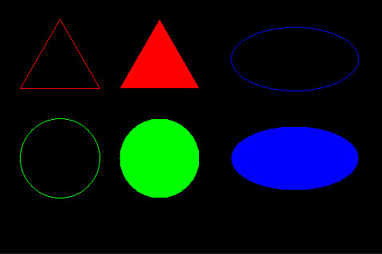

# Other Shapes

This document covers advanced geometric shapes supported by TFT Framework: Triangle, Circle, and Ellipse. These shapes inherit from `Shape` and implement the `Fillable` interface, allowing them to be drawn as outlines or filled with solid colors.

---

## Triangle

**Inherits:** `Shape`  
**Implements:** `Fillable`

A triangle is a three-sided polygon defined by three vertices. The first vertex is inherited from the `Shape` base class (accessible via `setPoint()`), while the second and third vertices are specific to the Triangle class.

### Constructor
```cpp
Triangle();  // Creates a triangle with default vertices at (0,0)
```

### Methods

#### Vertex Management
```cpp
// First vertex (inherited from Shape/Point)
void setPoint(Point p);
void setPoint(int16_t x, int16_t y);
Point getPoint() const;
int16_t getX() const;
int16_t getY() const;

// Second vertex
void setP2(Point p2);
void setP2(int16_t x, int16_t y);
Point getP2() const;

// Third vertex
void setP3(Point p3);
void setP3(int16_t x, int16_t y);
Point getP3() const;
```

#### Drawing Methods
```cpp
void draw(Screen* scr);  // Draw triangle outline
void fill(Screen* scr);  // Fill triangle with solid color
```

#### Movement
```cpp
void move(double direction, double distance);
// Moves all three vertices in the specified direction (degrees) by distance (pixels)
```

### Implementation Details

- **Outline drawing**: Uses three `Line` objects to connect the vertices
- **Fill algorithm**: Uses a scanline filling algorithm with proper sorting of vertices by Y-coordinate
- **Edge cases**: Handles flat-top, flat-bottom, and degenerate triangles correctly

### Example

```cpp
#include "tft_framework.h"

Screen* scr;

void setup() {
    // Initialize screen...
    
    // Create and configure triangle
    Triangle t;
    t.setRGB(0xFF0000);       // Red color
    t.setPoint(75, 25);       // First vertex (top)
    t.setP2(25, 112);         // Second vertex (bottom-left)
    t.setP3(125, 112);        // Third vertex (bottom-right)
    
    // Draw outline
    t.draw(scr);
    
    // Create a filled version shifted to the right
    t.move(90, 125);          // Move 125 pixels to the right
    t.fill(scr);
}
```

---

## Circle

**Inherits:** `Shape`  
**Implements:** `Fillable`

A circle is defined by a center point (inherited from `Shape`) and a radius. The implementation uses the efficient **Midpoint Circle Algorithm** (Bresenham-based) for fast rendering with integer-only arithmetic.

### Constructor
```cpp
Circle();  // Creates a circle with center at (0,0) and radius 0
```

### Methods

#### Configuration
```cpp
// Center point (inherited from Shape/Point)
void setPoint(Point p);
void setPoint(int16_t x, int16_t y);
int16_t getX() const;
int16_t getY() const;

// Radius
void setRadius(uint16_t r);
uint16_t getRadius() const;
```

#### Drawing Methods
```cpp
void draw(Screen* scr);  // Draw circle outline
void fill(Screen* scr);  // Fill circle with solid color
```

### Implementation Details

- **Algorithm**: Midpoint Circle Algorithm for efficient pixel plotting
- **Symmetry**: Exploits 8-fold symmetry to minimize computation
- **Performance**: Integer-only arithmetic for speed
- **Edge case**: Handles zero radius gracefully

### Example

```cpp
#include "tft_framework.h"

Screen* scr;

void setup() {
    // Initialize screen...
    
    // Create and configure circle
    Circle c;
    c.setRGB(0x00FF00);       // Green color
    c.setPoint(75, 200);      // Center point
    c.setRadius(50);          // Radius in pixels
    
    // Draw outline
    c.draw(scr);
    
    // Create a filled version shifted to the right
    c.move(90, 125);          // Move 125 pixels to the right
    c.fill(scr);
}
```

---

## Ellipse

**Inherits:** `Shape`  
**Implements:** `Fillable`

An ellipse (oval) is defined by a center point and two radii: horizontal (Rx) and vertical (Ry). The implementation uses the **Midpoint Ellipse Algorithm**, adapted from the circle algorithm to handle two different radii.

### Constructor
```cpp
Ellipse();  // Creates an ellipse with center at (0,0) and both radii 0
```

### Methods

#### Configuration
```cpp
// Center point (inherited from Shape/Point)
void setPoint(Point p);
void setPoint(int16_t x, int16_t y);
int16_t getX() const;
int16_t getY() const;

// Radii
void setRx(uint16_t rx);  // Set horizontal radius
void setRy(uint16_t ry);  // Set vertical radius
uint16_t getRx() const;   // Get horizontal radius
uint16_t getRy() const;   // Get vertical radius
```

#### Drawing Methods
```cpp
void draw(Screen* scr);  // Draw ellipse outline
void fill(Screen* scr);  // Fill ellipse with solid color
```

### Implementation Details

- **Algorithm**: Midpoint Ellipse Algorithm for efficient rendering
- **Symmetry**: Exploits 4-fold symmetry to reduce computation
- **Two regions**: Switches between horizontal and vertical scanning for optimal accuracy
- **Edge cases**: Handles zero radii gracefully

### Example

```cpp
#include "tft_framework.h"

Screen* scr;

void setup() {
    // Initialize screen...
    
    // Create and configure ellipse
    Ellipse e;
    e.setRGB(0x0000FF);       // Blue color
    e.setPoint(370, 70);      // Center point
    e.setRx(80);              // Horizontal radius
    e.setRy(40);              // Vertical radius
    
    // Draw outline
    e.draw(scr);
    
    // Create a filled version shifted down and right
    e.move(135, 180);         // Move diagonally
    e.fill(scr);
}
```

---

## Complete Example

This example demonstrates all three shapes with both outline and filled versions:

```cpp
#include "tft_framework.h"

Screen* scr;

void setup() {
    // Initialize your screen controller...
    // scr = new ILI9488_SPI_18Bit(...);
    
    scr->clear();  // Clear to black
    
    // ===== Triangle =====
    Triangle t;
    t.setRGB(0xFF0000);       // Red
    t.setPoint(75, 25);       // First vertex
    t.setP2(25, 112);         // Second vertex
    t.setP3(125, 112);        // Third vertex
    t.draw(scr);              // Draw outline
    
    t.move(90, 125);          // Move right
    t.fill(scr);              // Draw filled
    
    // ===== Circle =====
    Circle c;
    c.setRGB(0x00FF00);       // Green
    c.setPoint(75, 200);      // Center
    c.setRadius(50);          // Radius
    c.draw(scr);              // Draw outline
    
    c.move(90, 125);          // Move right
    c.fill(scr);              // Draw filled
    
    // ===== Ellipse =====
    Ellipse e;
    e.setRGB(0x0000FF);       // Blue
    e.setPoint(370, 70);      // Center
    e.setRx(80);              // Horizontal radius
    e.setRy(40);              // Vertical radius
    e.draw(scr);              // Draw outline
    
    e.move(180, 125);         // Move down and right
    e.fill(scr);              // Draw filled
}

void loop() {
    // Nothing needed here
}
```

### Output



---

## Common Features

All three shapes share these common features through inheritance:

### Color Management (from Shape)
```cpp
void setRGB(uint32_t rgb);      // Set color from 24-bit RGB
void setColor(Color c);          // Set color from Color object
void setRGB565(uint16_t rgb565); // Set color from 16-bit RGB565
Color getColor() const;          // Get current color
```

### Position Management (from Point/Shape)
```cpp
void setPoint(int16_t x, int16_t y);
void setPoint(Point p);
int16_t getX() const;
int16_t getY() const;
void move(double direction, double distance);  // Triangle only
```

### Drawing Interface (from Fillable)
```cpp
void draw(Screen* scr);  // Draw outline
void fill(Screen* scr);  // Draw filled
```

---

## Performance Notes

- **Circle and Ellipse**: Use optimized midpoint algorithms with integer arithmetic
- **Triangle**: Fill uses a scanline algorithm that handles all triangle types correctly
- **Memory**: All shapes are lightweight with minimal memory overhead
- **Speed**: Optimized for embedded systems with limited processing power

---

## See Also

- [Shape Base Class](shape.md)
- [Point Usage](PointUsage.md)
- [Line Usage](LineUsage.md)
- [Rectangle Usage](RectangleUsage.md)
- [Color Usage](ColorUsage.md)
