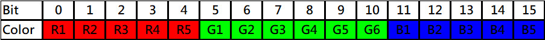

# Usage of Color

The tft_framework is using 5-6-5 color format. The following picture show how does the 16bit color work.



## Create a Point Object
The easiest way to create a Point.
```cpp
Point p;          // p will be initialled as x:0, y:0
```
We can provide initial values at creation time
```cpp
Point p(10, 15);  // x:10, y:15
```
We can create a Point with same as another Point.
```cpp
Point p1(20,30);
Point p2(p1);       // x:20, y:30
```
## Setter and getter
The following methods can get or change the properties of the Point object.
```cpp
int16_t getX();
int16_t getY();

void setX (int16_t x);
void setY (int16_t y);

void setPoint (int16_t x, int16_t y);
void setPoint (Point p);
```
## Move the Point
We can move the point by the move method.
```cpp
void move (double direction, double distance);

// Direction: 0 to 360 degree.
// 0 is North ( or upper side of the screen )
// 90 is the right side of the screen

// Example:
Point p(100,100);   // x:100, y:100
p.move(120,50);     // direction: 120 degree, distance.
                    // Finally, x: 143, y:125
```
