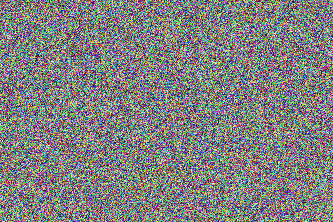

Class: Dot

Inherit class: Shape

# Usage of Dot

Dot is a 1x1 Rectangle to draw to the screen.

You can draw a dot to the screen after set the Point(position) and Color.

## Constructor

```cpp
Dot d;
```

## Methods about Point and Color
Dot is inherit [Shape](shape.md). It contains the methods and properties of [Point](PointUsage.md) and [Color](ColorUsage.md) also.

```cpp
Screen *scr ;
// Init your scr ...

Dot d;

uint16_t x = 100;
uint16_t y = 50;

uint8_t r = 63;
uint8_t g = 127;
uint8_t b = 255;

d.setPoint ( x, y );
d.setR ( r );
d.setG ( g );
d.setB ( b );

d.draw ( scr ) ;   // Draw the dot to the screen
```

## Examples
```cpp
Screen *scr ;

void setup ( ) {
  // Init your scr ...
  
  scr -> clear ( );
  randomSeed(analogRead(0));

  Dot d;
  uint16_t w = scr -> getWidth ( );
  uint16_t h = scr -> getHeight ( );

  for ( int y = 0; y < h; y ++ ) {
    for ( int x = 0; x < w; x ++ ) {
      d.setPoint ( x, y );
      d.setColor ( random ( 0xFFFF ) ) ;
      d.draw ( scr ) ;
    }
  }
}
```
Result:


