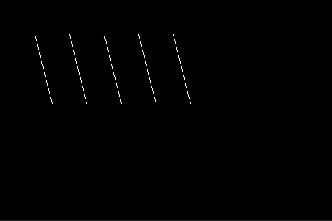

# Line

"Line" is composed of a series of points connected together through [Bresenham’s line algorithm](https://en.wikipedia.org/wiki/Bresenham%27s_line_algorithm). We can draw a line after the setting of color, start point and end point.

## Methods
There are methods other than basic Point and Color
```cpp
void setEndPoint ( Point p );
void setEndPoint ( int16_t x, int16_t y );
Point getEndPoint ( );

void moveTo ( Point p );
void moveTo ( int16_t x, int16_t y );
void moveToX ( int16_t x );
void moveToY ( int16_t y );

// lineTo: set the end point from the start point
void lineTo ( double direction, double distance );
```
## Examples
```cpp
Screen *scr ;

void setup ( ) {
  // Init your scr ...
  
  scr -> clear ( );

  Line l;
  l.setColor ( 0xFFFF );  // White color
  l.setPoint ( 50, 50 );
  l.setEndPoint ( 75, 150 );

  for ( int i = 0; i < 5; i ++ ) {
    l.draw ( scr );
    l.move ( 90, 50 );    // Move right side, distance 50
  }
}
```
Output:


