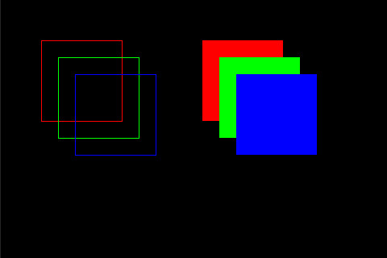

# Rectangle

Drawing any graphics will be based on "fillRect()". for example, "Dot" is a 1x1 and a horizonal / vertical line is 1xN rectangle fill. We need to override "fillRect()" When we implement a Screen instance.

Similar to line, Rectangle has color, point and endPoint.
It inherit Shape and Fillable. we can draw and fill a rectangle.

## Methods
```cpp
void setSize ( int16_t w, int16_t h );
void setSize ( Rectangle r );
void setWidth ( int16_t w );
void setHeight ( int16_t h );

uint16_t getWidth ( );
uint16_t getHeight ( );
```

The endPoint will at upper left side when the value of w or h is negative
## Example:
```cpp
Screen *scr ;

void setup ( ) {
  // Init your scr ...
  
  scr -> clear ( );

  // red, green and blue
  uint32_t colors[]={0xFF0000, 0x00FF00, 0x0000FF};

  Rectangle r;
  r.setPoint ( 50, 50 );
  r.setSize ( 100, 100 );

  for ( int i = 0; i < 3; i ++ ) {
    r.setRGB ( colors[i] ) ;
    r.draw ( scr ) ;
    r.move ( 135, 30 );
  }

  r.moveTo ( 250, 50 );

  for ( int i = 0; i < 3; i ++ ) {
    r.setRGB ( colors[i] ) ;
    r.fill ( scr ) ;
    r.move ( 135, 30 );
  }  
}
```
## Output

