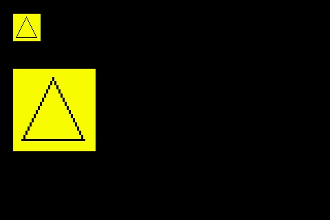

# Buffer Screen
The buffer is a virtual screen. You can draw something to it to store the content in the memories.
Then fill to the real screen. Sometimes it can be more efficiency. The buffer can be enlarge.
But be attention for the limitation of memory size. It need 2byte per pixel. There is 8k bytes inside the Arduino Mega 2560. That means the maxium bounds of buf can be about 60x60 only. And remember to deallocate it when not use. 
60x60x2 = 7200bytes

```cpp
Screen *scr ;

void setup ( ) {
  // Init your scr ...
  
  scr -> clear ( );

  BufferScreen *buf = new BufferScreen(40, 40); // Create the buffer with bounds 40x40.
  buf->setRGB(0xFFFF00);                        // Set the background Color to yellow.
  buf->clear();

  Triangle t;
  t.setPoint(4, 34);
  t.setP2(19, 4);
  t.setP3(34, 34);

  t.draw(buf);

  buf->setPoint(20, 20);
  buf->fill(scr); // Fill the buffer to real screen

  buf->setScale(3); // Enlarge to 3x
  buf->setPoint(20, 100);
  buf->fill(scr); // Fill the buffer to real screen

  delete buf; // Deallocate
}
```

## Output


