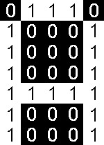
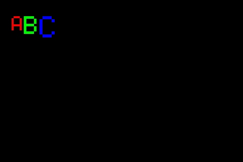

# Font

Font is a drawable shape (but not fillable). The 5x7 font is built-in at the framework as default font.

5x7 pixels font is a matrix array. It is stored at the program memories (ROM).

For example, the matrix 'A' is \[0x7E\], \[0x11\], \[0x11\], \[0x11\], \[0x7E\] ( See the source code [Font5X7.cpp](/tft_framework/src/Font5X7.cpp) )
```
Binary:
01111110 (0x7E)
00010001 (0x11)
00010001 (0x11)
00010001 (0x11)
01111110 (0x7E)
```
You can see there are 5x8 bits above because of more easier for handling. The first bit is always be 0 and to be skipped.

It will be rendered as the fowllowing picture:



The valid char range of 5x7 font is between the [ASCII](https://en.wikipedia.org/wiki/ASCII) code 0x20 to 0x7E.

## Methods
```cpp
uint32_t getChar();
void setChar(uint32_t c);

uint8_t getScale();
void setScale(uint8_t s);

// Dimension
uint8_t getWidth();
uint8_t getHeight();

// Total width is padding + spacing + width
uint8_t getTotalWidth ( );
uint8_t getTotalHeight ( );
```
## Examples
```cpp
Screen *scr ;

void setup ( ) {
  // Init your scr ...
  
  scr -> clear ( );

  Font *f = scr -> getFont ( ) ;
  f -> setScale ( 4 ) ;
  uint16_t w = f -> getTotalWidth ( ) ;
  uint16_t h = f -> getTotalHeight ( ) ;
  f -> setPoint ( w, h ) ;
  f -> setRGB ( 0xFF0000 ) ;
  f -> setChar ( 'A' ) ;
  f -> draw ( scr ) ;
  f -> move ( 90, w ) ;

  f -> setScale ( 5 ) ;
  w = f -> getTotalWidth ( ) ;
  f -> setRGB ( 0x00FF00 ) ;
  f -> setChar ( 'B' ) ;
  f -> draw ( scr ) ;
  f -> move ( 90, w ) ;

  f -> setScale ( 6 ) ;
  w = f -> getTotalWidth ( ) ;
  f -> setRGB ( 0x0000FF ) ;
  f -> setChar ( 'C' ) ;
  f -> draw ( scr ) ;
}
```
## Output



