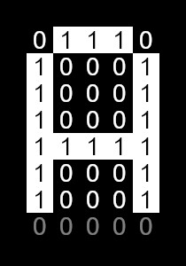

# Font

Font is a drawable shape (but not fillable). The 5x7 font is built-in at the framework as default font.

5x7 pixels font is a matrix array. It is stored at the program memories (ROM).

For example, matrix 'A' is \[0x7E\], \[0x11\], \[0x11\], \[0x11\], \[0x7E\] ( See the source code [Font5X7.cpp](/src/Font5X7.cpp) )

Binary is: 01111110, 00010001, 00010001, 00010001, 01111110

You can see there are 5x8 bits above because of more easier for handling. It is iterated from the last bit to the first bit. And the first bit is ignored.

It will be rendered as the fowllowing picture:



The valid char range of 5x7 font is between the [ASCII](https://en.wikipedia.org/wiki/ASCII) code 0x20 to 0x7E.

## Methods
```cpp
uint32_t getChar();
virtual void setChar(uint32_t c);

uint8_t getScale();
void setScale(uint8_t s);

// Dimension
uint8_t getWidth();
uint8_t getHeight();

// Padding
uint8_t getPaddingTop();
uint8_t getPaddingLeft();
uint8_t getPaddingBottom();
uint8_t getPaddingRight();

void setPaddingTop(uint8_t paddingTop);
void setPaddingLeft(uint8_t paddingLeft);
void setPaddingBottom(uint8_t paddingBottom);
void setPaddingRight(uint8_t paddingRight);

// Spacing
uint8_t getSpacingTop();
uint8_t getSpacingLeft();
uint8_t getSpacingBottom();
uint8_t getSpacingRight();

void setSpacingTop(uint8_t spacingTop);
void setSpacingLeft(uint8_t spacingLeft);
void setSpacingBottom(uint8_t spacingBottom);
void setSpacingRight(uint8_t spacingRight);

// Total width is padding + spacing + width
virtual uint8_t getTotalWidth ( );
virtual uint8_t getTotalHeight ( );
```
