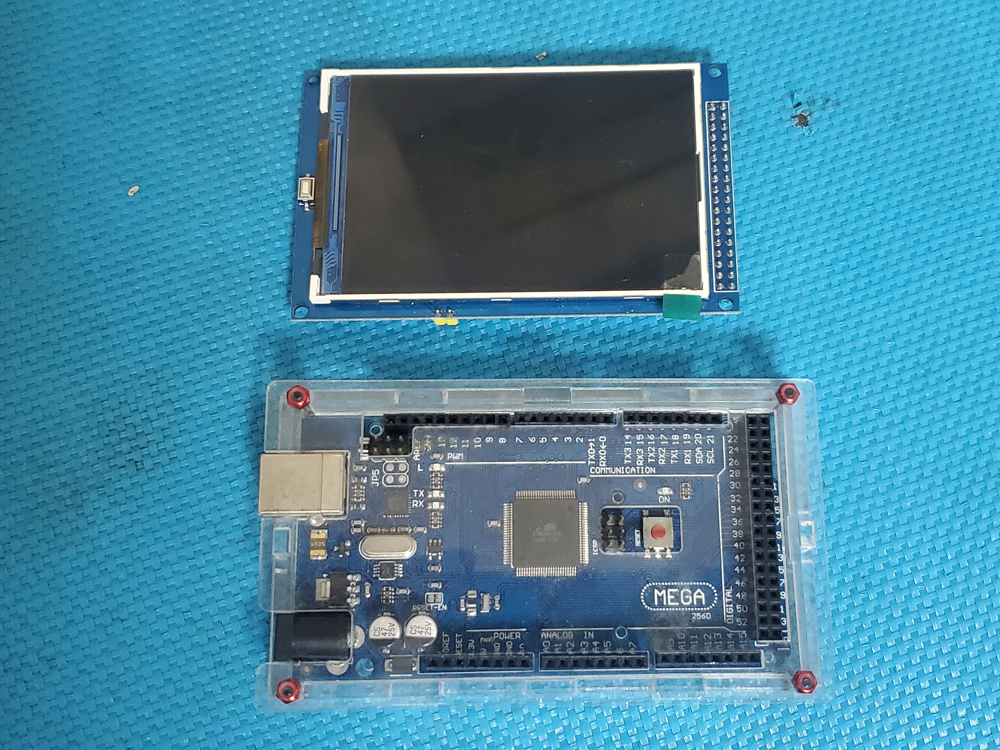
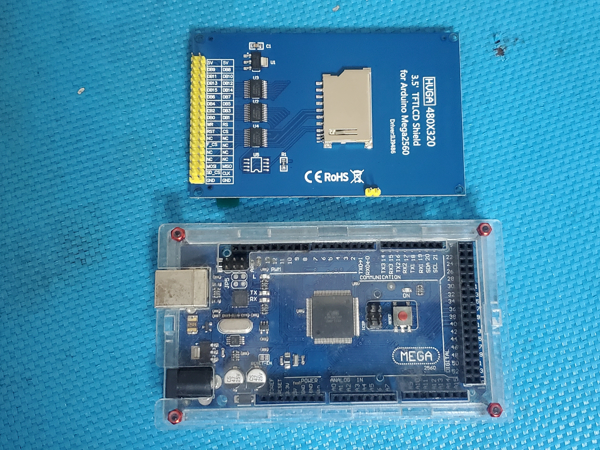

# tft_framework
TFT Framework is the graphic interface for TFT Screen with Arduino.
It provide the generic method to drawing, filling and print.

There is a sample:
https://youtu.be/qud3bSVzDqk

 


# Hello World
```cpp
#include <ILI9486_Parallel_16Bit.h>

using namespace tft_framework;

Screen* scr;

void setup () {
    scr = new ILI9486_Parallel_16Bit ( ) ;
    scr -> init ();
    scr -> clear ();
    scr -> println ( "Hello world" );   // Print text to the screen
}

void loop () { delay ( 100000 ) ; }
```
