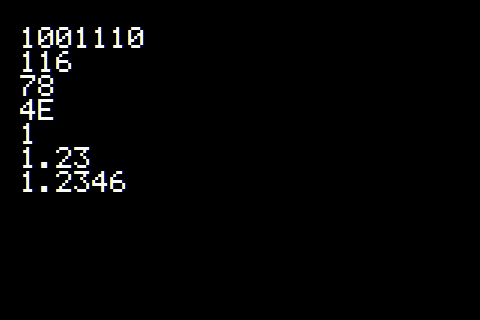

# Screen print

The Screen class is inherit Print. Similar to Arduino Serial. We can call print(), println(), printf(), write(), flush() methods to output text to the screen.

## Example

```cpp
Screen *scr ;

void setup ( ) {
  // Init your scr ...
  
  scr -> clear ( );

  Font *fnt = scr -> getFont ( );
  fnt -> setScale ( 3 );

  w = fnt -> getTotalWidth();
  h = fnt -> getTotalHeight();

  scr -> setCursor(w, h);

  scr -> println(78, BIN);      // gives "1001110"
  scr -> println(78, OCT);      // gives "116"
  scr -> println(78, DEC);      // gives "78"
  scr -> println(78, HEX);      // gives "4E"
  scr -> println(1.23456, 0);    // gives "1"
  scr -> println(1.23456, 2);   // gives "1.23"
  scr -> println(1.23456, 4);   // gives "1.2346"
}
```

## Example



## Cursor

This is a Point used to set the position of print.

```cpp
void setCursor ( Point cursor );
Point getCursor ( );
void resetCursor ( );
```

## Cursor Example

```
Screen *scr ;

void setup ( ) {
  // Init your scr ...
  scr -> clear ( ) ;

  Font *fnt = scr -> getFont ( );
  fnt -> setScale ( 2 );

  Rectangle r;
  r.setSize ( 300, 200 );
  r.setPoint ( 70, 50 );
  r.setRGB ( 0x0000FF );
  r.fill ( scr );

  scr -> setCursor ( r );
  int16_t x = scr -> getCursor ( ) .getX ( ) ;
  int16_t y = scr -> getCursor ( ) .getY ( ) ;
  scr -> printf ( "Cursor: %d, %d\n", x, y ) ;

  for ( int i = 0; i < 5; i++ ) {
    x = scr -> getCursor ( ) .getX ( ) ;
    y = scr -> getCursor ( ) .getY ( ) ;
    scr -> printf ( "Cursor: %d, %d\n", x, y ) ;
  }

  fnt -> setColor ( 0 ) ;
  scr -> resetCursor ( );
  scr -> print ( "----------------" );
}
```

## Print Buffer

Usually, we first output the text to the buffer and then fill it into the screen.

```cpp
void setBuffer ( boolean b );
boolean isBuffer ( );
```
