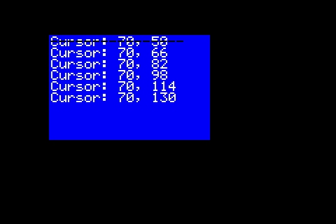
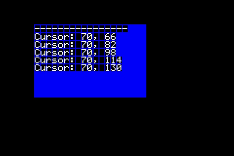
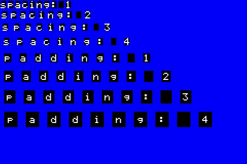

# Screen print

The Screen class is inherit Print. Similar to Arduino Serial. We can call print(), println(), printf(), write(), flush() methods to output text to the screen.

## Example

```cpp
Screen *scr ;

void setup ( ) {
  // Init your scr ...
  
  scr -> clear ( );

  Font *fnt = scr -> getFont ( );
  fnt -> setScale ( 3 );

  w = fnt -> getTotalWidth();
  h = fnt -> getTotalHeight();

  scr -> setCursor(w, h);

  scr -> println(78, BIN);      // gives "1001110"
  scr -> println(78, OCT);      // gives "116"
  scr -> println(78, DEC);      // gives "78"
  scr -> println(78, HEX);      // gives "4E"
  scr -> println(1.23456, 0);    // gives "1"
  scr -> println(1.23456, 2);   // gives "1.23"
  scr -> println(1.23456, 4);   // gives "1.2346"
}
```

## Example


## Cursor

This is a Point used to set the position of print.

```cpp
void setCursor ( Point cursor );
Point getCursor ( );
void resetCursor ( );
```

## Cursor Example

```cpp
Screen *scr ;

void setup ( ) {
  // Init your scr ...
  scr -> clear ( ) ;

  Font *fnt = scr -> getFont ( );
  fnt -> setScale ( 2 );

  Rectangle r;
  r.setSize ( 300, 200 );
  r.setPoint ( 70, 50 );
  r.setRGB ( 0x0000FF );
  r.fill ( scr );

  scr -> setCursor ( r );
  int16_t x = scr -> getCursor ( ) .getX ( ) ;
  int16_t y = scr -> getCursor ( ) .getY ( ) ;
  scr -> printf ( "Cursor: %d, %d\n", x, y ) ;

  for ( int i = 0; i < 5; i++ ) {
    x = scr -> getCursor ( ) .getX ( ) ;
    y = scr -> getCursor ( ) .getY ( ) ;
    scr -> printf ( "Cursor: %d, %d\n", x, y ) ;
  }

  fnt -> setColor ( 0 ) ;
  scr -> resetCursor ( );
  scr -> print ( "----------------" );
}
```

## Cursor Example Output



## Print Buffer
At the example above. There is overlaped at the first line when reset cursor. Print buffer output the text to the buffer firstly. and then fill it into the screen with background color. ( More about [Buffer Screen](./buffered_screen.md) )

```cpp
void setBuffer ( boolean b );
boolean isBuffer ( );
```

## Print buffer example
```cpp
Screen *scr ;

void setup ( ) {
  // Init your scr ...
  scr -> clear ( ) ;

  // Same as above example. But add this line.
  scr -> setPrintBuffer ( true );

  Font *fnt = scr -> getFont ( );
  fnt -> setScale ( 2 );

  Rectangle r;
  r.setSize ( 300, 200 );
  r.setPoint ( 70, 50 );
  r.setRGB ( 0x0000FF );
  r.fill ( scr );

  scr -> setCursor ( r );
  int16_t x = scr -> getCursor ( ) .getX ( ) ;
  int16_t y = scr -> getCursor ( ) .getY ( ) ;
  scr -> printf ( "Cursor: %d, %d\n", x, y ) ;

  for ( int i = 0; i < 5; i++ ) {
    x = scr -> getCursor ( ) .getX ( ) ;
    y = scr -> getCursor ( ) .getY ( ) ;
    scr -> printf ( "Cursor: %d, %d\n", x, y ) ;
  }

  scr -> resetCursor ( );
  scr -> print ( "----------------" );
}
```
## Output


## Spacing and padding

## Example
```cpp
  // Init your scr ...
  scr -> clear ( );
  scr -> setPrintBuffer (true);

  Font *fnt = scr -> getFont ( );
  fnt -> setScale ( 2 );

  Rectangle r;
  r.setSize ( scr -> getWidth(), scr -> getHeight() );
  r.setRGB ( 0x0000FF );
  r.fill ( scr );

  for ( int i = 1; i <= 4; i++ ){
    fnt -> setSpacingTop ( i );
    fnt -> setSpacingLeft ( i );
    fnt -> setSpacingBottom ( i );
    fnt -> setSpacingRight ( i );
    scr -> printf ( "spacing: %d\n", i );
  }

  for ( int i = 1; i <= 4; i++ ){
    fnt -> setPaddingTop ( i );
    fnt -> setPaddingLeft ( i );
    fnt -> setPaddingBottom ( i );
    fnt -> setPaddingRight ( i );
    scr -> printf ( "padding: %d\n", i );
  }
}
```

## Output


