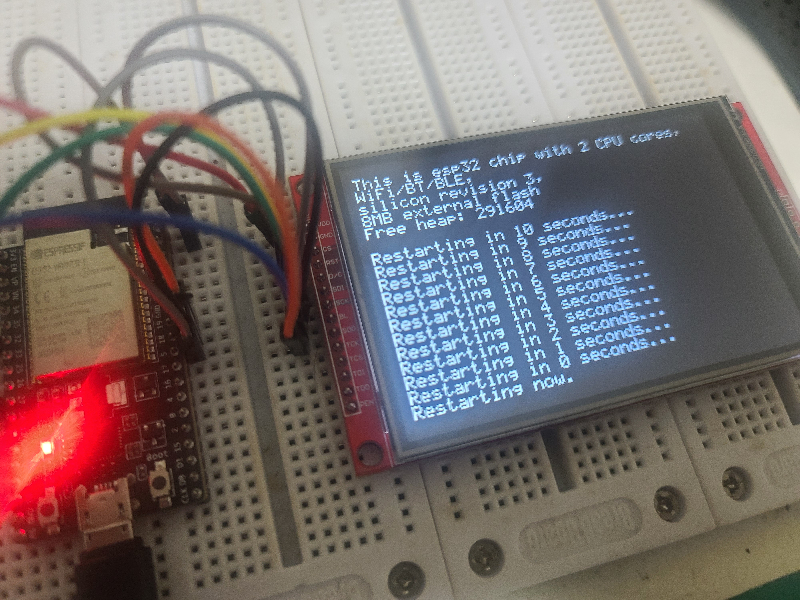

# Add support ESP32 with ILI9486 18-Bit

The ILI9488 SPI 18-Bit(6-6-6 Color) has implemented. It support for ESP32 only temporary (Basically it should be support ALL of MCU which have SPI).

YouTube Demo: https://youtu.be/k89JIES1duM

## Default Wiring
